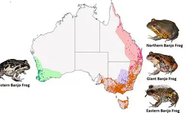

Source : [australian.museum](https://australian.museum/blog/amri-news/do-pobblebonks-sing-to-suit-their-surrounds/)

Cette semaine, le tidytuesday porte sur des données d'observations de grenouilles en Australie, dont l'article est diponible [ici](https://australian.museum/blog/amri-news/frogid-dataset-6/) \n

Pour cette première participation, je vais simplement créer une heatmap pour visualiser la densité des observations sur la carte de l'Australie. Pour cela, on aura besoin du package `{leaflet}` et `{leaflet.extras}`

Dans un premier temps, on va récupérer les données de la semaine.

```r
library(tidytuesdayR)
library(dplyr)
library(leaflet)
library(leaflet.extras)

tuesdata <- tt_load("2025-09-02")

frog_id <- tuesdata$frogID_data
```

```{r}
#| echo: false
#| eval: true
library(dplyr)
library(leaflet)
library(leaflet.extras)
frog_id <- read.csv("data/frogs.csv")
```


L'étape de transformation de données sera assez simple :

-   Nettoyer les noms de colonnes

-   Compter le nombre d'observation pour chaque combinaison de coordonnées

```{r cleaning}
df <- frog_id %>%
  select(
    lat = decimalLatitude,
    lon = decimalLongitude,
    name = scientificName
  ) %>%
  group_by(lat, lon) %>%
  count()
```

Pour le plaisir, je rajouterai les provinces du pays sur la carte. \n

Ensuite, il suffit de créer la carte avec \`leaflet()\`.

```{r plot}
# Créer le nom des provinces
aus_provinces <- data.frame(
  name = c(
    "New South Wales",
    "Victoria",
    "Queensland",
    "Western Australia",
    "South Australia",
    "Tasmania",
    "Northern Territory"
  ),
  latitude = c(-32, -36.5, -25, -26, -30, -42, -20),
  longitude = c(151, 145, 148, 117, 137, 147, 131)
)


leaflet(df) %>%
  addTiles() %>%
  addHeatmap(
    lng = ~lon,
    lat = ~lat,
    intensity = ~n,
    blur = 1,
    max = 10,
    radius = 15
  ) %>%
  addLabelOnlyMarkers(
    lng = ~ aus_provinces$longitude,
    lat = ~ aus_provinces$latitude,
    label = ~ aus_provinces$name,
    labelOptions = labelOptions(
      noHide = TRUE,
      direction = 'auto',
      textOnly = TRUE
    )
  )
```

Cette carte permet de voir facilement que la côte Ouest a une densité d'observation bien plus importante que le reste du pays, principalement autour de Syndey et Melbourne, avec également un grand nombre d'observations autour de Perth à l'Ouest.
